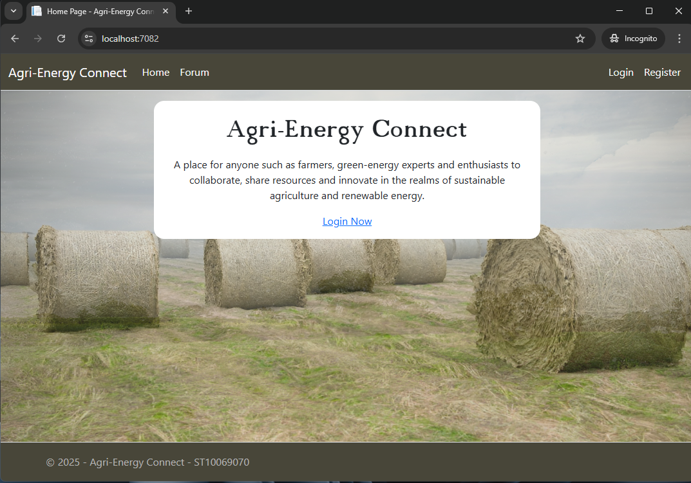
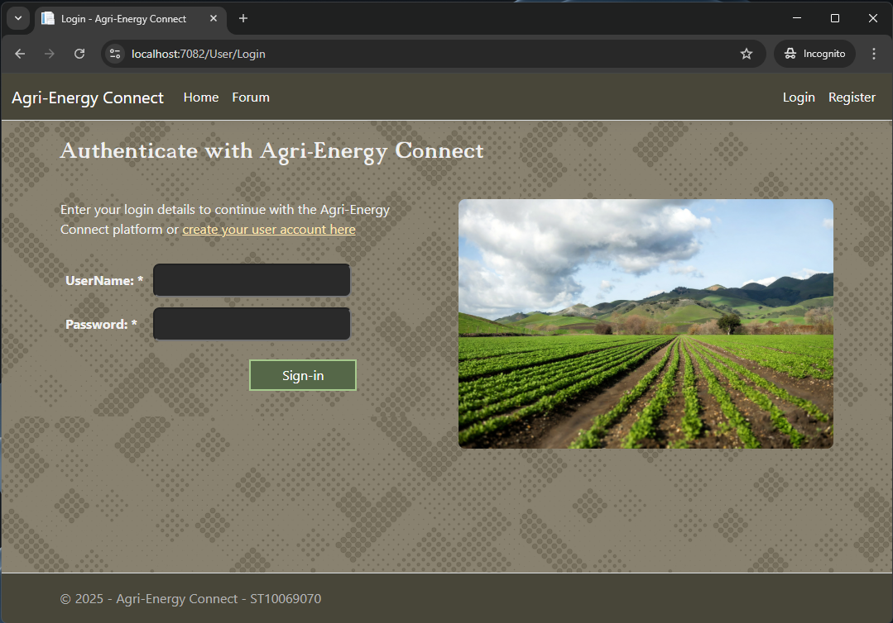
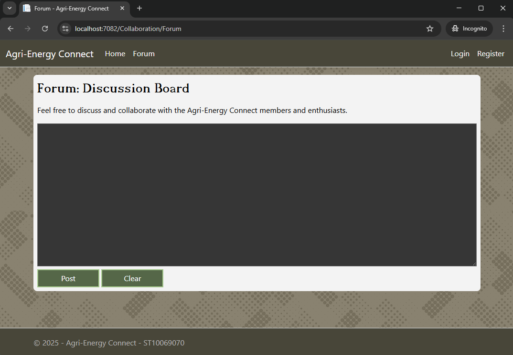
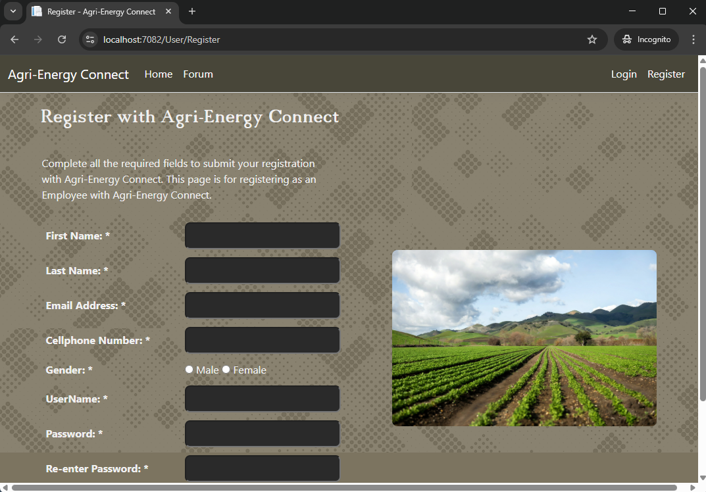
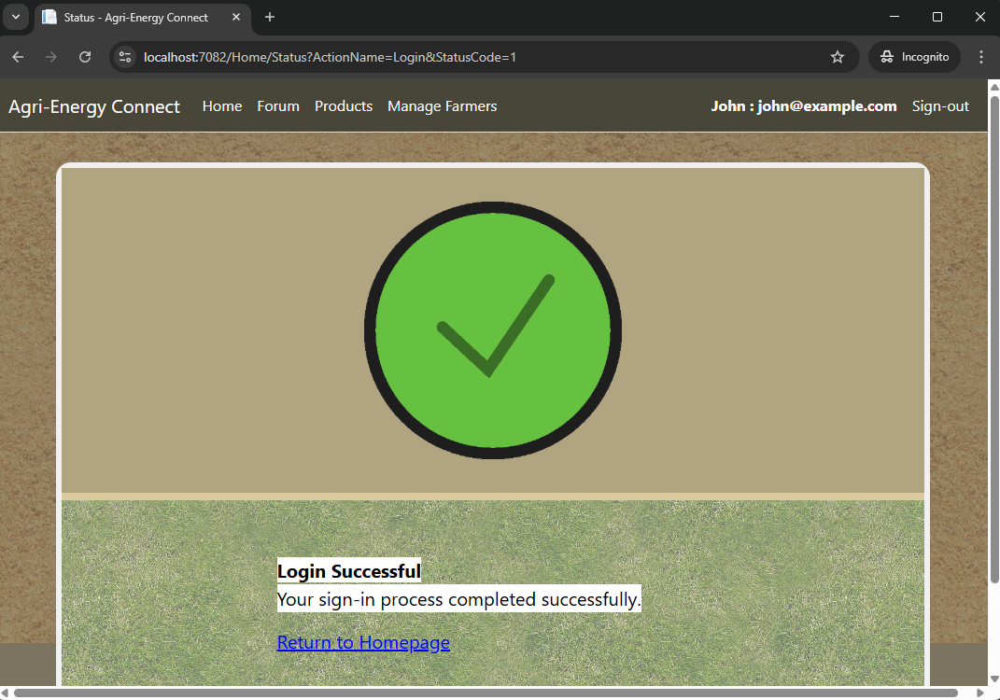
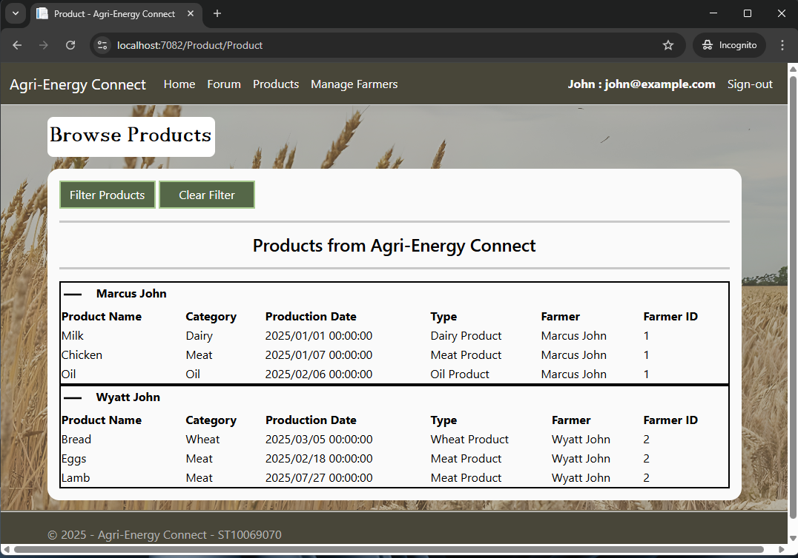
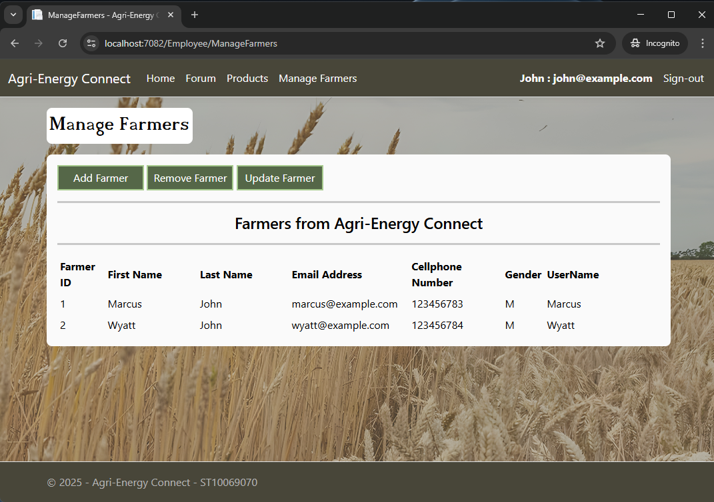

# Agri-Energy Connect
**Developed by:** Matthew De Waal

**Student Number:** ST10069070

**Module:** Programming 3A

**Written in:** C# (Visual Studio)

**Note:** This README file will show you how to set up the development environment for the Agri-Energy Connect platform and how to build and launch the system.

### Development Environment
This section will show you how to set up the development environment with Visual Studio.

**Step 1:** Download this project to your device.

**Step 2:** Open this project with Visual Studio.

**Step 3:** This project uses Entity Framework Core on a SQLite database. You must run the following command to create the database on your device. Enter this command in the Package Manager Console: **update-database AgriEnergyConnect_ST10069070**. This will create the database to your local device. Use any SQLite Database Management System to view the database. The database will be pre-populated with data to use.

**Step 4:** In Visual Studio, you can build and run the project by clicking on the green arrow button. You can use **https** or **IIS Express** when running the web application. The recommended option to use is **IIS Express**.

### System Functionalities and User Roles
The Agri-Energy Connect platform supports two types of users who are Employees and Farmers. An Employee has more priviledges than a Farmer and they can add Farmer profiles to the system. A Farmer cannot create his/her own profile, they require the Employee's permission to create their user account. Farmers can add their own products and Employees can view all products from specific Farmers. Employees and Farmers can perform filtering operations to find specific products from the database. You can filter products according to the Production Date. You can input a single **date and time** value for the Production Date. You can also perform a date range by providing two **date and time** values. To perform a date range, enter the start **date and time** and end **date and time**, seperated by a semi-colon. For example: **2025/02/02 00:00:00;2025/05/05 00:00:00** You can either provide the date or time only. It does not have to be together in the Production Date field.

The platform also comes with a discussion board to allow farmers, green-energy experts and enthuasiats to share ideas and collaborate with each other. You can submit a discussion anonymously or you can submit discussions with your user account. The homepage includes a slide-show which displays images in sequence, repeatedly. In order to view data from the Agri-Energy Connect platform, you must first be logged in to your user account. You can create a new user account by clicking on the Register link. When registering, you must provide a strong password with a minimum of four alphabetical letters, two numerical digits and two special symbols. Password Example: **abcd12!@**, this password includes four alphabetical letters, two numerical digits and two special symbols.

On the Products page, you can expand or collpase different products that a farmer owns. Click on the Plus icon to expand the view or click on the Minus icon to collapse the view. On the ManageFarmers page, you can add, remove and update farmer details. You will see a list of all the farmers from Agri-Energy Connect.

You can sign-out of your user account by clicking on the Sign-Out link at the top right corner of the webpage. You can also Login or Register by clicking on the links at the top right corner of the webpage.

### Screenshots of Agri-Energy Connect platform
**Homepage**

This is the official landing page for Agri-Energy Connect.

**Login page**

This is the authentication page that will allow employees and farmers to login.

**Forum page**

Employees, Farmers and anonymous users can collaborate on this page.

**Register page**

This page is only for Employees to register.

**Status page**

This page shows the status of any operation with Agri-Energy Connect.

**Product page**

Employees and Farmers can view the products from Agri-Energy Connect.

**Manage Farmers page**

Only Employees have permission to this page. This page allows Employees to add, remove and update farmer details.

